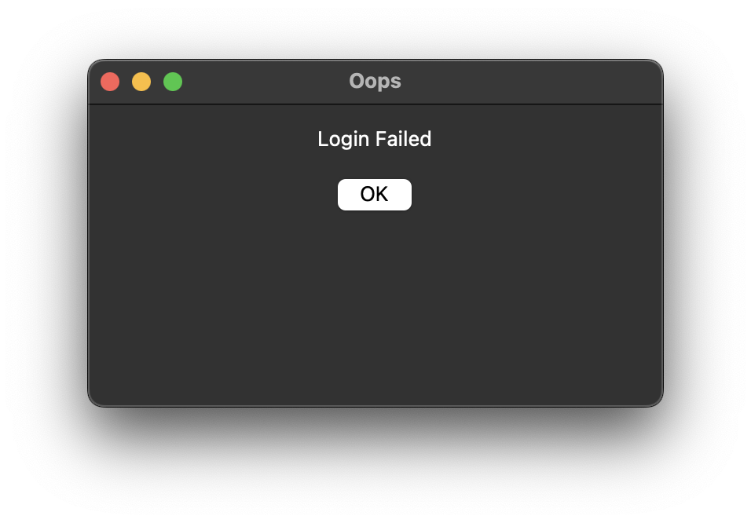

# Quiz Program

A simple quiz application with user authentication, supporting both students and instructors. The program uses a graphical user interface (GUI) built with Tkinter for login and error handling. Students can take quizzes and view their scores, while instructors can create quizzes.

## Focus
- **Python**
- **Object Oriented Programming (OOP)**
- **Tinker (GUI)**
- **csv file handlig with I/O**

## Features

- **User Authentication:** Login system for students and instructors.
- **Student Functionality:** Take quizzes, view scores.
- **Instructor Functionality:** Create quizzes, manage student data.
- **GUI:** Tkinter-based windows for login, confirmation, errors, and pop-ups.
- **Quiz Management:** Quizzes are loaded from CSV files.

## File Structure

- `user.py` — Contains `Student`, `Instructor`, and `System` classes for user management and quiz logic.
- `gui.py` — Handles all GUI windows (login, confirmation, error, pop-ups).
- `quiz.py` — Defines the `Quiz` class for quiz creation and management.
- `Quizfiles/` — Directory containing quiz CSV files (e.g., `quiz1.csv`).
- `Run.py` or `SencereRabel-test_run.py` — Main entry point scripts.

## How It Works

1. **Start the Program:** Run `Run.py`.

2. **Login:** Enter your username and password in the GUI window.
3. **Role-Based Actions:**
    - **Student:** Take a quiz and view your score.
    - **Instructor:** Create and manage quizzes.


4. **Error Handling:** If an error occurs, an error window will be displayed.

5. **Responce Submission:** Select you answer and click submit.

6. **Receive live feedback:** Current score is shown at the top.

7. **Final Score:** Displayed at the end.

## Requirements

- Python 3.x
- Tkinter (usually included with Python)
- CSV files for quizzes in the `Quizfiles/` directory

## Getting Started

1. Clone the repository.
2. Ensure you have Python 3 installed.
3. Place your quiz CSV files in the `Quizfiles/` directory.
4. Run the main script:

    ```bash
    python Run.py
    ```
## Contributors
- `Sencere Rabel`
    - Github: `https://github.com/SencereRabel`
- `Marcos Hernandez`
    - Github: `https://github.com/MarcoAxel`

## License

MIT License